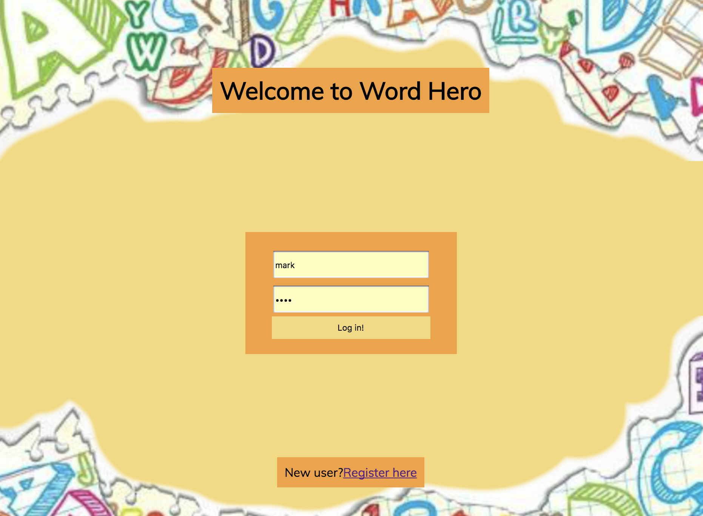
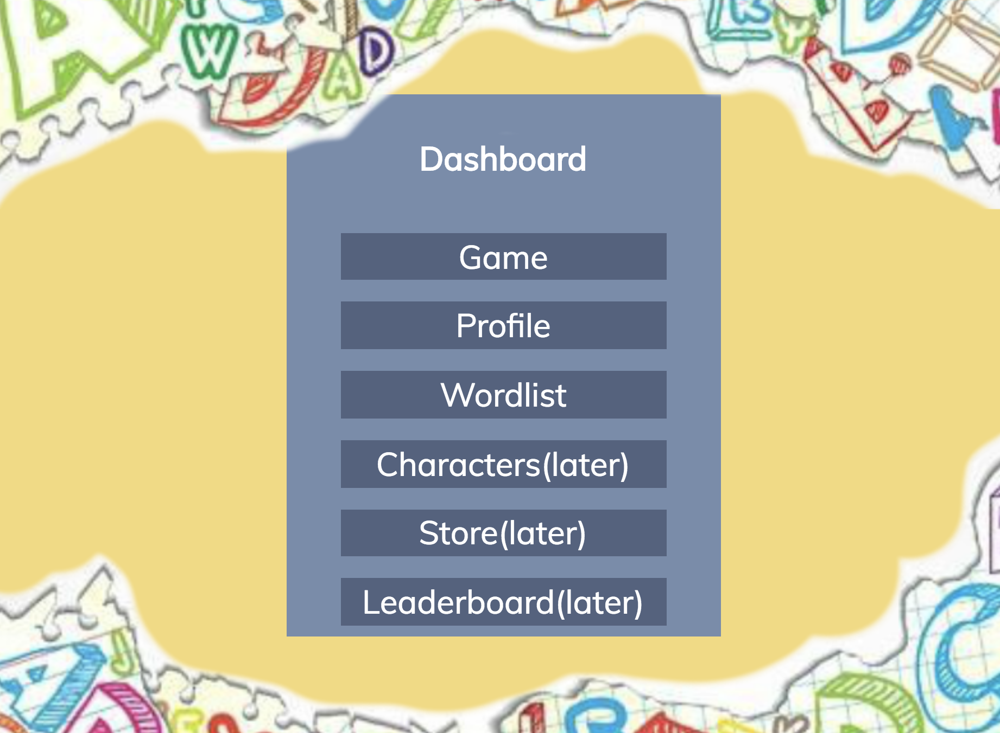
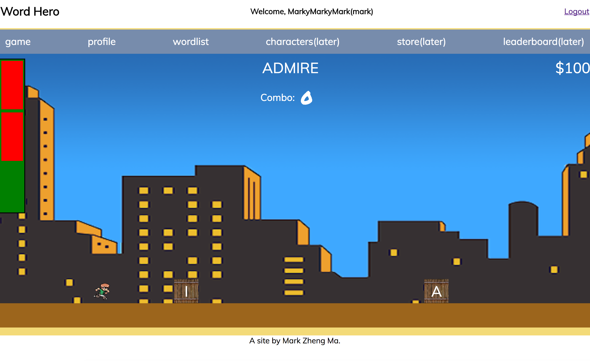

# Word Hero

https://word-hero.herokuapp.com/

## Introduction
Do you want to learn a language while having fun? Do you like platform running games and want to collect more meaningful loots such as language elements? This is the game you should choose -- Word Hero, giving you the chance to enjoy the process of learning.

## Get Started
Users could register and log in their own accounts. In their own accounts, users could review their own word lists, checkout the details and modify it as well. In order to build their own word list, users have to go through the game room. In the game room, users spell words by hitting the crates with letters according to the spelling order of the words. Wrong spelling would result in a HP subtract. After users spell a word correctly, this word would be saved to their word lists, if the word does not exist in their list already.

During this game, users could keep practicing the word spelling: getting familiar with new words and reviewing the old words. This is also meaningful for reinforcing learning results.

## Screenshots

## Technology Used
* HTML5
* CSS3
* Javascript
* React.js
* Express.js
* SQL