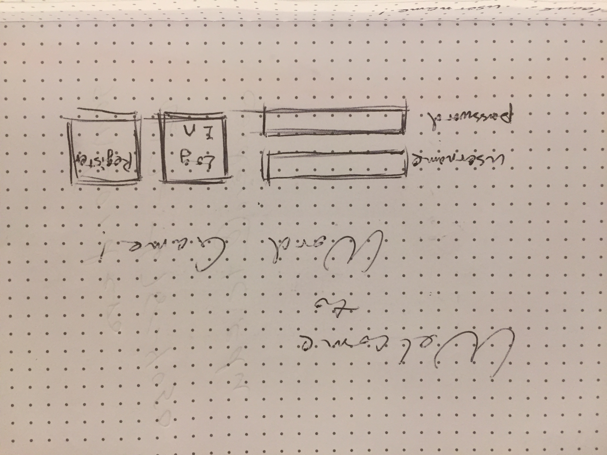
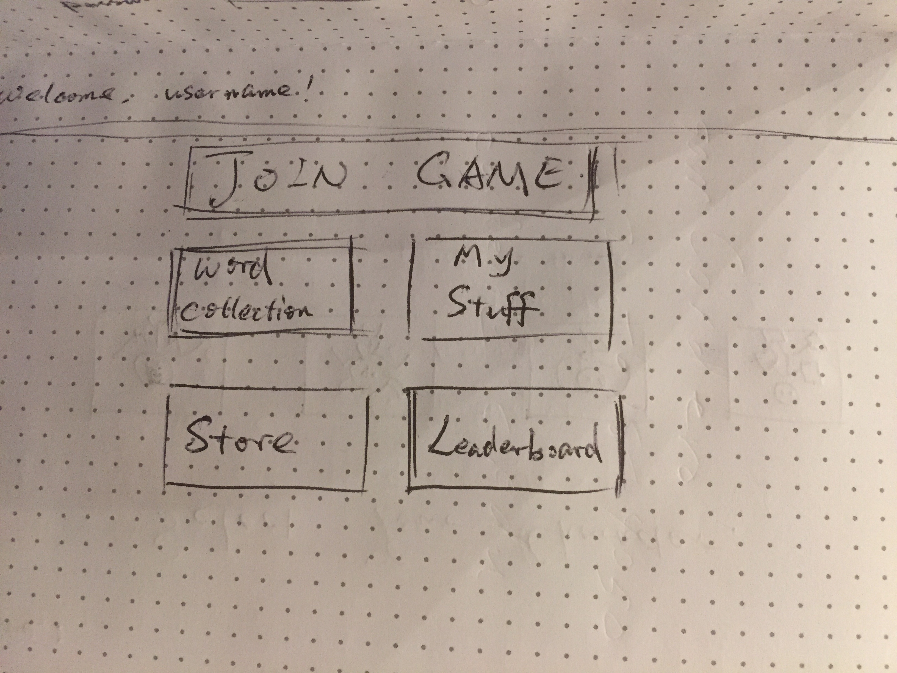
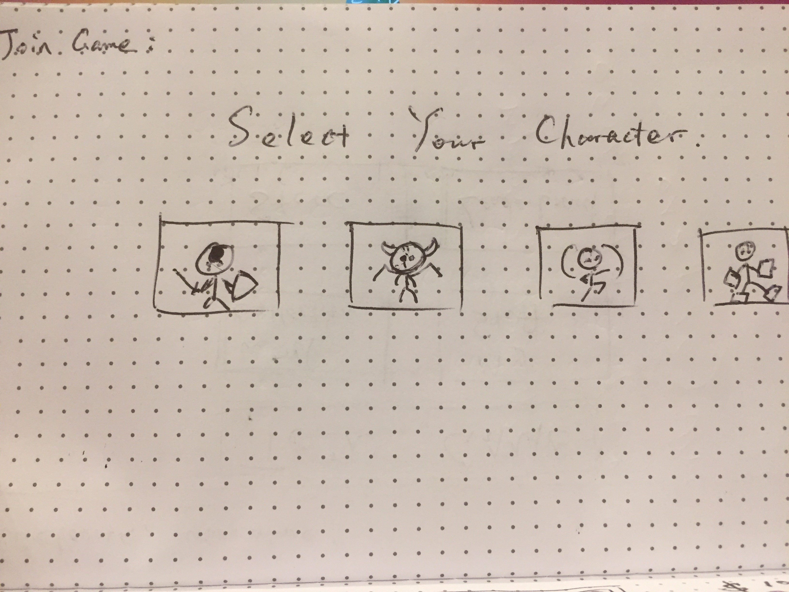
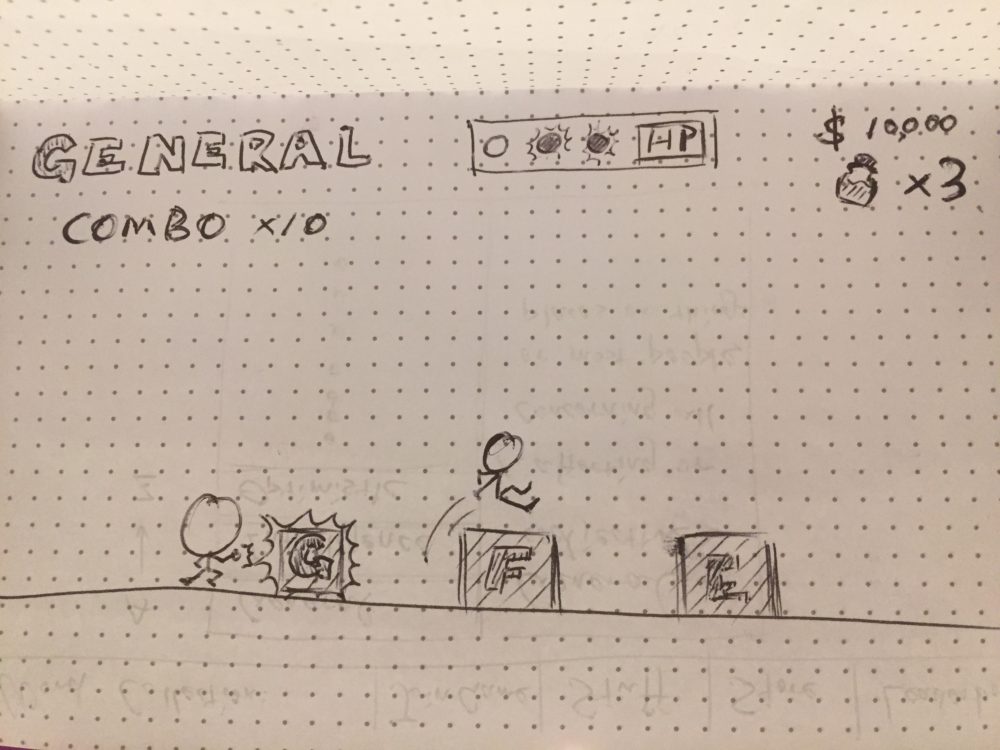
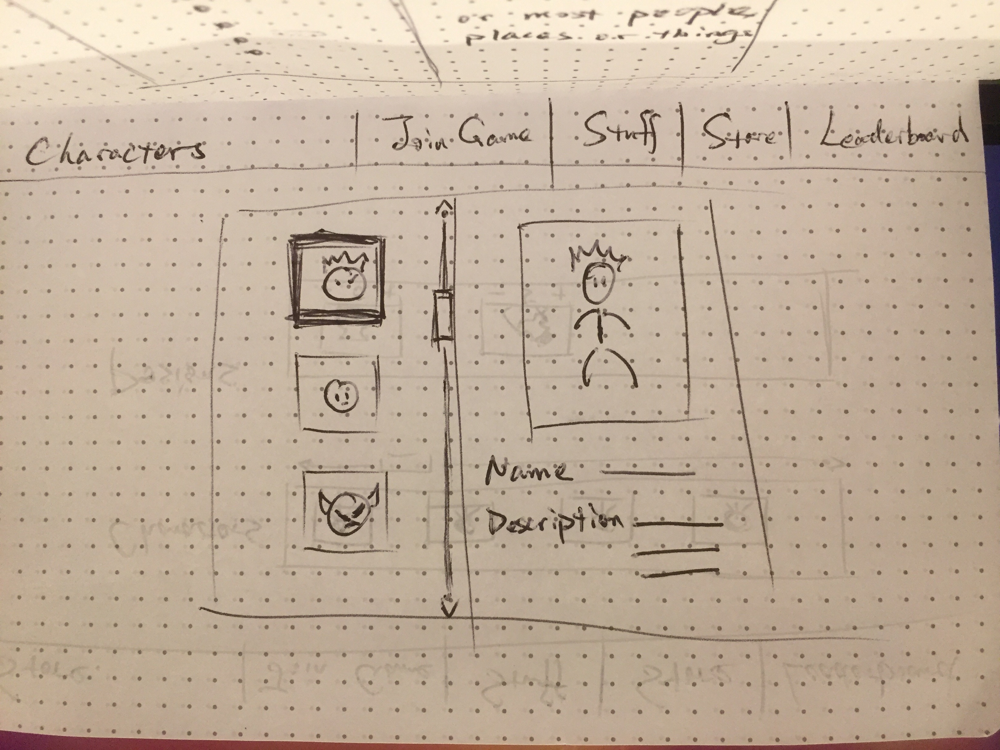
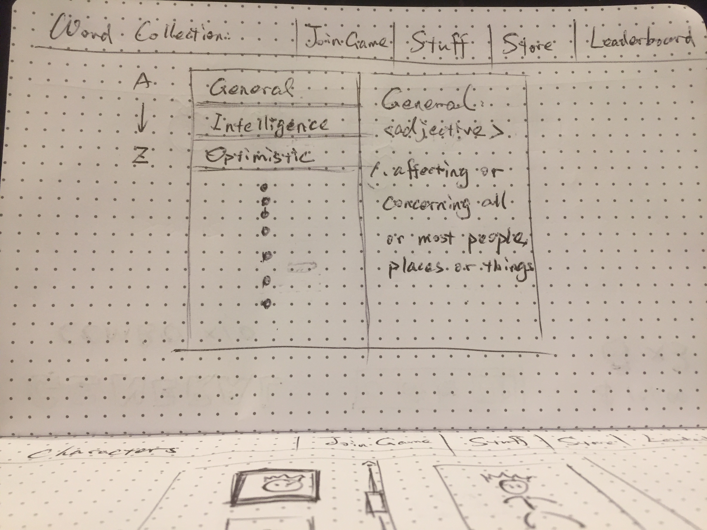
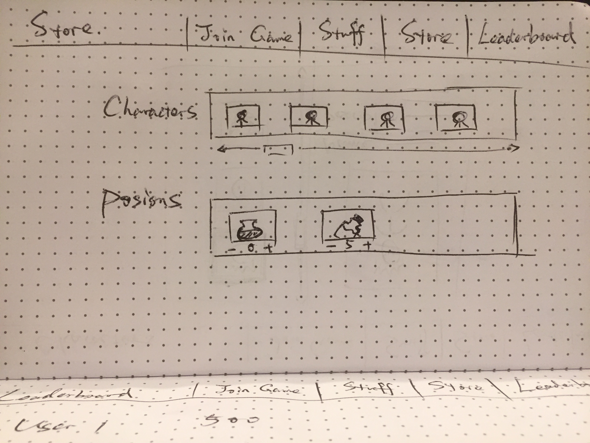
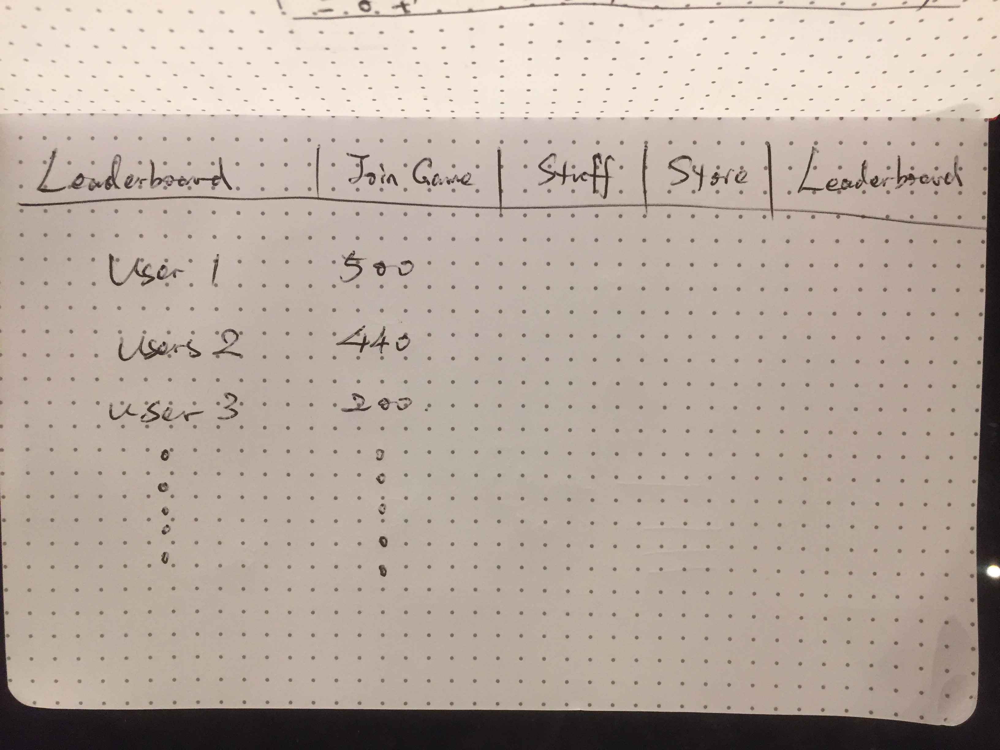
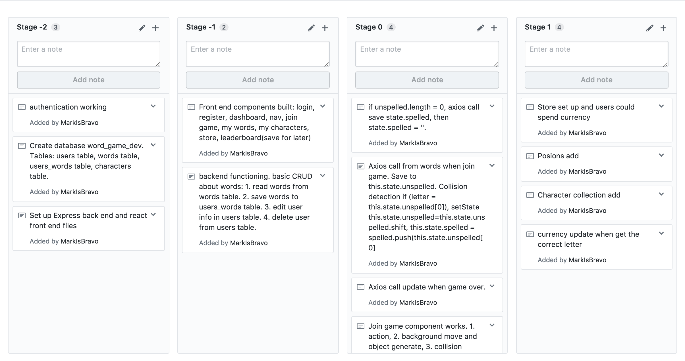

# Word-Game Proposal

## What is Word-Game?

An action game allows language learners remember words while having fun. Play the game with the character of your choice. Collect letters that could build the given word and avoid the ones that could not. Earn coins while collecting letters and spend them to get cool stuff!

## Wireframe

## Initial thoughts on game structure

Stages:
* Login/Register
* Home Page: Buttons to access "Join Game", "My Stuff", "Word Collection", "Store" and "Leaderboard".
* Join Game: User could join game after select a character to play the game. Control the character to smash or jump over/glide under the boxes with letters. According to the word showing on the top of the screen, the user need to choose which boxes to smash or avoid. 
Smashing the correct boxes will add coins while smashing the wrong ones or hit the boxes will subtract HP. User could use either HP posion or smashing specific boxes to recover HP
There will be a given amount of time for user to build the word by smashing them. If complete the word within the given amount of time, all boxes will become smashable during the rest of the given amount of time, turning back when the time is over and new word showing up.
* Word Collection: All words that user have successfully spelled.
* My Stuff: The collection of characters and inventory of all kinds of consumables, at the begining this would be only HP posion.
* Store: User could use coins to by new characters and other consumables.
* Leaderboard: Top ten users who has the largest word collection.

Database:
* users table: users' info and number of consumables.
* words table: words completed by users, linked to users table by user_id

## Workflow

